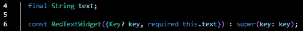

## **(2141720047) Yasmine Navisha Andhani - TI_3G**
Link Github : 

# Jobsheet Pertemuan 10 - Manajemen Plugin

## Langkah 1: Buat Project Baru
Buatlah sebuah project flutter baru dengan nama flutter_plugin_pubdev. Lalu jadikan repository di GitHub Anda dengan nama flutter_plugin_pubdev.

## Langkah 2: Menambahkan Plugin
Tambahkan plugin auto_size_text menggunakan perintah berikut di terminal

Jika berhasil, maka akan tampil nama plugin beserta versinya di file pubspec.yaml pada bagian dependencies.

## Langkah 3: Buat file red_text_widget.dart
Buat file baru bernama red_text_widget.dart di dalam folder lib lalu isi kode seperti berikut.

## Langkah 4: Tambah Widget AutoSizeText
Masih di file red_text_widget.dart, untuk menggunakan plugin auto_size_text, ubahlah kode return Container() menjadi seperti berikut.

Setelah Anda menambahkan kode di atas, Anda akan mendapatkan info error. Mengapa demikian? Jelaskan dalam laporan praktikum Anda!
Jawab: 

## Langkah 5: Buat Variabel text dan parameter di constructor
Tambahkan variabel text dan parameter di constructor seperti berikut.

## Langkah 6: Tambahkan widget di main.dart
Buka file main.dart lalu tambahkan di dalam children: pada class _MyHomePageState

## Hasil Output 
Run aplikasi tersebut dengan tekan F5, maka hasilnya akan seperti berikut.

---
### Pertanyaan
1. Jelaskan maksud dari langkah 2 pada praktikum tersebut!

    Jawab : Kode pada langkah 2 merupakan perintah untuk menambahkan paket 'auto_size_text' yang berguna untuk mengatur ukuran teks secara otomatis dalam Flutter berdasarkan faktor seperti panjang teks, lebar widget, dan sebagainya.

2. Jelaskan maksud dari langkah 5 pada praktikum tersebut!

    Jawab :

    * 'final String text;' Merupakan deklarasi variabel dengan nama text yang bertipe data String (teks). Variabel ini akan digunakan untuk menyimpan teks yang akan ditampilkan atau digunakan dalam widget ini. Kata kunci final berarti nilai variabel text tidak bisa diubah setelah nilainya ditetapkan.

    * 'const RedTextWidget({Key? key, required this.text})' Kode ini mendefinisikan widget bernama RedTextWidget yang akan menampilkan teks dengan warna merah, dan teks yang akan ditampilkan diberikan melalui parameter text saat widget ini dibuat.

3. Pada langkah 6 terdapat dua widget yang ditambahkan, jelaskan fungsi dan perbedaannya!

    Jawab :

    * Fungsi Widget 1 : color: Colors.yellowAccent: Untuk mengatur background dari Container menjadi kuning terang (yellowAccent).
    width: 50: Untuk engatur lebar Container menjadi 50 piksel. child: const RedTextWidget(...): Merupakan isi dari Container. Di dalamnya, kita dapat menempatkan widget RedTextWidget. RedTextWidget adalah widget yang berisi teks dengan warna merah. 

    * Fungsi Widget 2 : color: Colors.greenAccent: Untuk mengatur background dari Container menjadi hijau terang (greenAccent). width: 100: Untuk mengatur lebar Container menjadi 100 piksel. child: const Text(...): Merupakan isi dari Container. Di dalamnya, kita dapat menuliskan widget Text, yang digunakan untuk menampilkan teks.

    Perbedaan :

    * Widget pertama menggunakan widget RedTextWidget. RedTextWidget adalah widget khusus yang kemungkinan besar telah dibuat sebelumnya dan memiliki warna teks merah.

    * Container kedua menggunakan widget bawaan Flutter, yaitu Text. Text adalah widget umum yang digunakan untuk menampilkan teks dengan tampilan default, yang akan memiliki warna dan gaya yang ditentukan oleh tema dari aplikasi.

4. Jelaskan maksud dari tiap parameter yang ada di dalam plugin auto_size_text berdasarkan tautan pada dokumentasi ini !

    Jawab :

    |Parameter | Penjelasan |
    | ----------- | :---------: |
    | key *| Digunakan untuk mengidentifikasi dan membedakan widget dalam pohon widget. |
    | textKey | Digunakan untuk mengidentifikasi dan mengakses widget tertentu yang berisi teks tertentu.  |
    | style * | Digunakan mengontrol berbagai aspek tampilan teks, seperti warna, ukuran, ketebalan, gaya, dan lainnya.  |
    | minFontSize | Digunakan untuk menentukan ukuran font minimum yang akan digunakan oleh AutoSizeText. |
    | maxFontSize | Digunakan untuk menentukan ukuran font maximum yang akan digunakan oleh AutoSizeText. |
    | stepGranularity | Berguna untuk mengatur jumlah langkah atau granularity saat menggeser nilai widget. |
    | presetFontSizes | Berguna untuk menentukan semua ukuran yang memungkinkan |
    | group | Digunakan untuk mengelompokkan beberapa AutoSizeText bersama untuk mengatur ukuran teksnya agar seragam sesuai dengan widget yang memiliki ukuran teks terbesar dalam grup. |
    | textAlign * | Berguna untuk menyesuaikan ukuran teks agar sesuai dengan lebar yang tersedia, |
    | textDirection * | Untuk menentukan apakah teks tersebut akan dibaca dari kiri ke kanan atau sebaliknya, dari kanan ke kiri |
    | locale * | Digunakan dalam konteks lain dalam Flutter, seperti dalam widget Localizations atau MaterialApp untuk mengatur preferensi bahasa dan negara (locale) aplikasi. |
    | softWrap * | Proses mengatur teks dalam beberapa baris baru secara otomatis saat teks melebihi lebar maksimum yang tersedia dalam widget. |
    | wrapWords | Digunakan untuk mengontrol perilaku pemotongan (word wrap) teks ketika teks tersebut melebihi lebar area yang tersedia. |
    | overflow * | Digunakan untuk mengendalikan teks saat teks yang ingin ditampilkan melebihi ruang yang tersedia dalam widget. |
    | overflowReplacement | Digunakan sebagai pengganti teks jika teks dalam widget AutoSizeText tidak cukup untuk muat dalam ruang yang tersedia dan mengalami overflow (terpotong).  |
    | textScaleFactor * | Digunakan untuk mengatur faktor skalasi teks, yang memengaruhi ukuran teks yang ditampilkan dalam widget AutoSizeText.  |
    | maxLines | Digunakan untuk mengatur jumlah maksimum baris yang akan ditampilkan untuk teks yang diatur. |
    | semanticsLabel * | Digunakan untuk menentukan teks yang akan digunakan untuk tujuan aksesibilitas (accessibility) saat perangkat pengguna menggunakan layanan aksesibilitas |